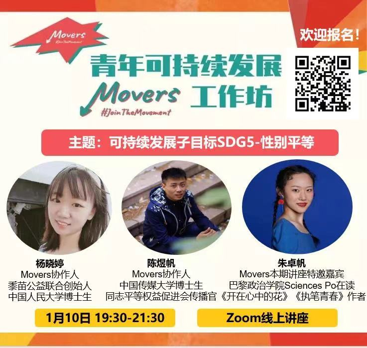
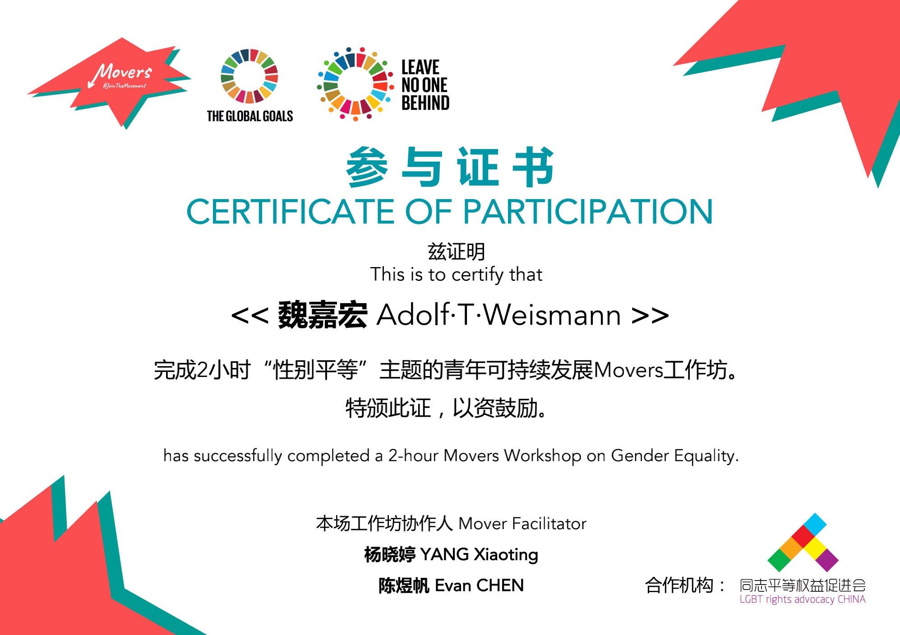

```
---
layout: post
title:  "我的第二篇文章"
background: "/assets/images/2021-01-10-2.jpg"
category: "工作"
tags: 感悟
---
```


# 科技遇见她

## 分享我与科技的#HERstory

### 一小时编程挑战直播课，我来交作业啦～

_联合国开发计划署_

_联合国妇女署_

_Coding Girls Club_


> 在联合国#平等的一代#倡导活动的框架之下，联合国开发计划署（UNDP）与联合国妇女署（UN Women）共同发起#HERstory# #科技遇见她#倡议活动，聚焦科技领域、开启故事征集，将许许多多个体的故事汇流成川，为广大有志进入科技领域的女性赋予信心。


## 参加了Movers组织的第一场性别平等工作坊～






