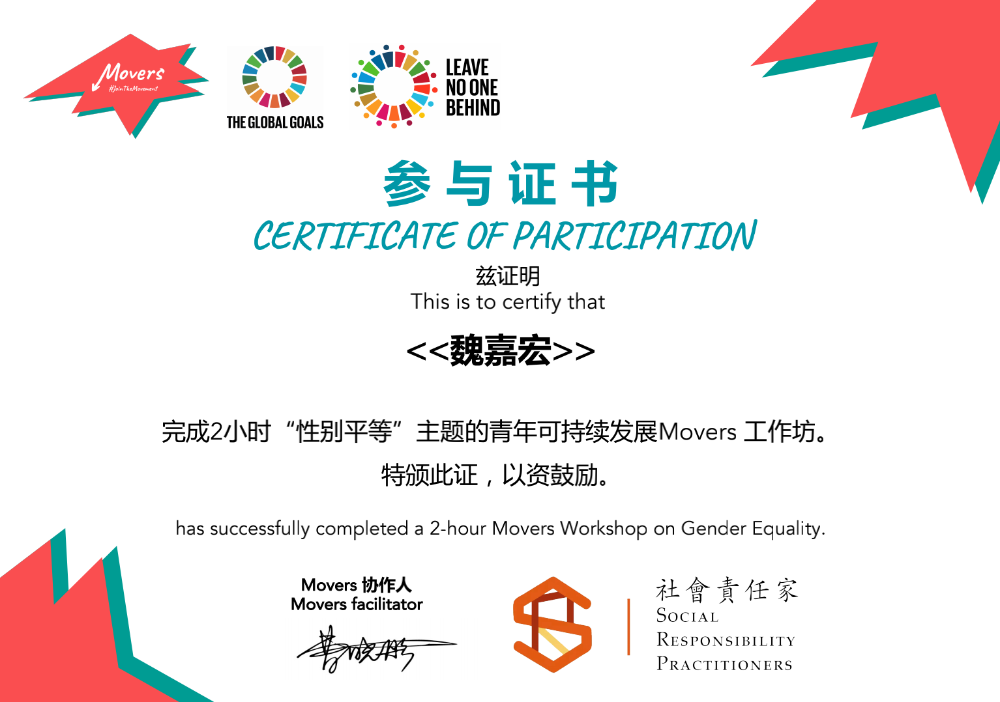

```
---
layout: post
title:  "我的第三篇文章"
background: "/assets/images/2021-01-22.jpg"
category: "工作"
tags: 感悟
---
```


# 科技遇见她

## 分享我与科技的#HERstory

### 一小时编程挑战直播课，我来交作业啦～

_联合国开发计划署_

_联合国妇女署_

_Coding Girls Club_


> 在联合国#平等的一代#倡导活动的框架之下，联合国开发计划署（UNDP）与联合国妇女署（UN Women）共同发起#HERstory# #科技遇见她#倡议活动，聚焦科技领域、开启故事征集，将许许多多个体的故事汇流成川，为广大有志进入科技领域的女性赋予信心。

参加Movers组织的第二场性别平等的工作坊啦～



# 画重点，这次的合作方发起的项目哦～👇

## SRP海外华人女性保护项目

### 该项目致力于改善目标女性群体的生活，同时强调目标女性群体的自我赋权，通过社群形式实现帮扶的广度延伸， 形成互相扶持的良性循环。项目自2020年7月起在比利时开启试点，预计在3年时间内将能够覆盖全球华人最多的30个国家。截止到2020年12月，该项目共有**151名志愿者**参与，现已搭建救助组织、庇护所网络、法律网络、医疗网络、心理网络等相关资料库共446条，成功外联国内外合作伙伴共**49家**，其中深度合作的合作伙伴有17家。已帮助来自比利时、卢森堡、 法国、德国、荷兰、捷克、美国国家的37名女性。
